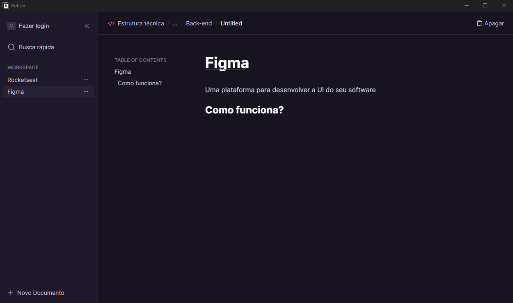

# Rotion

    

## :computer: Projeto

Este foi um projeto feito durante um curso para aprender a desenvolver apps desktop com Electron. O objetivo do projeto é criar arquivos para anotações que ficam salvos no localmente na sua máquina, com ele eu pude aprender a trabalhar com as camadas do Electron(Main, Preload e Renderer) e alguns funcionalidades nativas como o tray menu. Caso queira instalar na sua máquina, acesse esse [link](https://github.com/erik-ferreira/rotion/releases).

## :rocket: Tecnologias

- [Electron](https://www.electronjs.org/pt/)
- [React](https://reactjs.org)
- [Tailwindcss](tailwindcss.com)
- [Radix Ui Components](https://www.radix-ui.com)

## :thinking: Como rodar o projeto?

1. Execute `npm i` para instalar as dependências

2. Execute `npm run dev` para rodar o projeto
